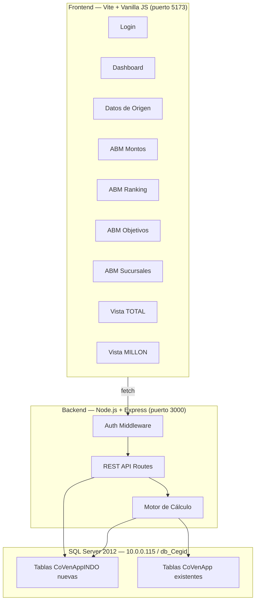

# Sistema de Comisiones INDO - Plan Final

## Contexto

### Base de datos existente
- **Server**: `10.0.0.115` (SVRBKP-BAL) — SQL Server 2012
- **Database**: `db_Cegid`
- **Auth**: `sa` / `MicroS123`
- **Login app**: Tabla `dbo.TBL_USUARIOS_APPS` (idusuario, descUsuario, contraseña, nombre, apellido, idPerfil, activo)

### Tablas CoVenApp existentes (ya en uso para vendedores)
| Tabla | Propósito | Registros |
|-------|-----------|-----------|
| `tbl_CoVenApp_VTAMILLON` | Ventas Millón por operador/día | 98,626 |
| `tbl_CoVenApp_Vendedores` | Maestro de vendedores | 913 |
| `tbl_CoVenApp_encargados` | Maestro de encargados | 38 |
| `tbl_CoVenApp_GrillaVendedoresINDO` | Ventas consolidadas por vendedor/mes | 2,834 |
| `tbl_CoVenApp_GrillaComisionesINDO` | Comisiones calculadas vendedores | 2,834 |
| `tbl_CoVenApp_EscalonesINDO` | Escalones por sucursal/mes | 527 |
| `tbl_CoVenApp_ImportesEscalonesINDO` | Importes por escalón | 9 |
| `tbl_CoVenApp_FechaCalculoINDO` | Control de períodos procesados | 24 |
| `tbl_CoVenApp_ConfigReglas` | Reglas configurables | 6 |

### SPs existentes (cadena de ejecución para vendedores)
```
SP_ComisionesINDO (orquestador)
  → sp_CoVenApp_CargarGrillaVendedoresDetallesINDO (detalle diario desde dw_vallejo)
  → sp_CoVenApp_CargarGrillaVendedoresINDO (consolida por sucursal)
  → sp_CoVenApp_CargarGrillaVendedoresPROPORCIONALINDO (ajuste licencias)
  → sp_CoVenApp_ComisionarINDO (marca si comisiona)
  → sp_CoVenApp_LlenarEscalonesINDO (calcula escalones/sucursal)
  → sp_CoVenApp_CalcularComisionesINDO (asigna comisión por vendedor)
```

Los datos de **consumo, efectivo y reporte** del Excel vienen de INDO (sistema financiero) y no están en estas tablas aún. Se incorporarán como ABM manual inicialmente.

---

## Nuevas Tablas a Crear (sufijo CoVenAppINDO)

```sql
-- Sucursales con datos de gestión
CREATE TABLE dbo.tbl_CoVenAppINDO_Sucursales (
    id INT PRIMARY KEY,                    -- Nº sucursal
    nombre VARCHAR(100),
    supervisor VARCHAR(100),
    provincia VARCHAR(50),
    provincia_code VARCHAR(10),
    marca VARCHAR(50),                     -- vallejo, sportotal, etc.
    region VARCHAR(50),                    -- CUYO, NOA, etc.
    activa BIT DEFAULT 1
);

-- Montos por sección/escalón/categoría
CREATE TABLE dbo.tbl_CoVenAppINDO_Montos (
    id INT IDENTITY PRIMARY KEY,
    seccion VARCHAR(50),                   -- OPER_CON_EFECT, OPER_SIN_EFECT, ENCARGADO, ENC_MILLON
    escalon INT,                           -- 1, 2, 3
    participacion DECIMAL(12,2),
    escalon_monto DECIMAL(12,2),
    subtotal DECIMAL(12,2),
    ticket_promedio DECIMAL(12,2),
    operacion DECIMAL(12,2),
    total DECIMAL(12,2),
    categoria_suc CHAR(1) DEFAULT 'C'      -- C=base, B, A
);

-- Montos vendedores (FULL/PART/CAJERO)
CREATE TABLE dbo.tbl_CoVenAppINDO_MontosVendedor (
    id INT IDENTITY PRIMARY KEY,
    escalon INT,
    tipo_vendedor VARCHAR(10),             -- FULL, PART, CAJERO
    monto DECIMAL(12,2),
    categoria_suc CHAR(1) DEFAULT 'C'
);

-- Montos supervisor
CREATE TABLE dbo.tbl_CoVenAppINDO_MontosSupervisor (
    id INT IDENTITY PRIMARY KEY,
    concepto VARCHAR(20),                  -- consumo, efectivo
    monto DECIMAL(12,2),
    tipo VARCHAR(20),                      -- por_sucursal, por_plaza
    factor_plaza DECIMAL(4,2) DEFAULT 0.5,
    categoria_suc CHAR(1) DEFAULT 'C'
);

-- Montos préstamos por sucursal
CREATE TABLE dbo.tbl_CoVenAppINDO_MontosPrestamos (
    id INT IDENTITY PRIMARY KEY,
    escalon INT,
    tipo VARCHAR(20),                      -- suc, suc13
    monto DECIMAL(12,2),
    categoria_suc CHAR(1) DEFAULT 'C'
);

-- Montos cajero fijo
CREATE TABLE dbo.tbl_CoVenAppINDO_MontosCajero (
    id INT IDENTITY PRIMARY KEY,
    monto DECIMAL(12,2),
    categoria_suc CHAR(1) DEFAULT 'C'
);

-- Ranking por período
CREATE TABLE dbo.tbl_CoVenAppINDO_Ranking (
    id INT IDENTITY PRIMARY KEY,
    sucursal_id INT,
    categoria CHAR(1),                     -- A, B, C
    override_manual BIT DEFAULT 0,
    periodo VARCHAR(7)                     -- '2026-03'
);

-- Multiplicadores de ranking
CREATE TABLE dbo.tbl_CoVenAppINDO_RankingMultiplicador (
    categoria CHAR(1) PRIMARY KEY,         -- A, B, C
    multiplicador DECIMAL(4,2)             -- 1.30, 1.15, 1.00
);

-- Objetivos consumo por período
CREATE TABLE dbo.tbl_CoVenAppINDO_ObjConsumo (
    id INT IDENTITY PRIMARY KEY,
    sucursal_id INT,
    periodo VARCHAR(7),
    participacion DECIMAL(6,4),
    primer_escalon DECIMAL(14,2),
    credito_promedio DECIMAL(12,2),
    operaciones DECIMAL(10,2),
    cobranza DECIMAL(14,2),
    dias INT
);

-- Objetivos efectivo por período
CREATE TABLE dbo.tbl_CoVenAppINDO_ObjEfectivo (
    id INT IDENTITY PRIMARY KEY,
    sucursal_id INT,
    periodo VARCHAR(7),
    primer_escalon DECIMAL(14,2),
    credito_promedio DECIMAL(12,2),
    operaciones DECIMAL(10,2),
    dias INT
);

-- Datos de consumo (cargados desde INDO o manualmente)
CREATE TABLE dbo.tbl_CoVenAppINDO_DatosConsumo (
    id INT IDENTITY PRIMARY KEY,
    sucursal_id INT,
    periodo VARCHAR(7),
    ventas DECIMAL(14,2),
    vta_diaria DECIMAL(14,2),
    particip_vta DECIMAL(8,4),
    vta_vta_tot DECIMAL(8,4),
    credito_promedio DECIMAL(12,2),
    operaciones INT,
    pers_op INT,
    particip_op DECIMAL(8,4),
    cobranzas DECIMAL(14,2),
    cob_diaria DECIMAL(14,2),
    particip_cob DECIMAL(8,4),
    cant_cob INT,
    pers_cob INT,
    obj_vtas DECIMAL(14,2)
);

-- Datos de efectivo
CREATE TABLE dbo.tbl_CoVenAppINDO_DatosEfectivo (
    id INT IDENTITY PRIMARY KEY,
    sucursal_id INT,
    periodo VARCHAR(7),
    ventas DECIMAL(14,2),
    vta_diaria DECIMAL(14,2),
    particip_vta DECIMAL(10,6),
    vta_vta_tot DECIMAL(8,4),
    credito_promedio DECIMAL(12,2),
    operaciones INT,
    pers_op INT,
    particip_op DECIMAL(10,6),
    cobranzas DECIMAL(14,2),
    cob_diaria DECIMAL(14,2),
    particip_cob DECIMAL(10,6),
    cant_cob INT,
    pers_cob INT,
    obj_vtas DECIMAL(14,2)
);

-- Datos reporte (originaciones de crédito)
CREATE TABLE dbo.tbl_CoVenAppINDO_DatosReporte (
    id INT IDENTITY PRIMARY KEY,
    periodo VARCHAR(7),
    id_originacion INT,
    estado VARCHAR(50),
    usuario_originador VARCHAR(50),
    fecha_alta DATETIME,
    producto VARCHAR(50),                  -- EFECTIVO, CONSUMO
    importe_capital DECIMAL(14,2),
    cantidad_cuotas INT,
    id_prestamo INT,
    id_sucursal INT,
    sucursal VARCHAR(100),
    id_plan INT
);

-- Historial de cálculos
CREATE TABLE dbo.tbl_CoVenAppINDO_CalculoHistorial (
    id INT IDENTITY PRIMARY KEY,
    periodo VARCHAR(7),
    fecha_calculo DATETIME DEFAULT GETDATE(),
    usuario VARCHAR(50),
    resultado_json NVARCHAR(MAX)
);
```

---

## Arquitectura de la Aplicación



### Estructura de Archivos

```
Comisiones/
├── .env
├── package.json
├── vite.config.js
├── index.html
├── server/
│   ├── index.js
│   ├── config/db.js
│   ├── middleware/auth.js
│   ├── routes/
│   │   ├── auth.js
│   │   ├── datos.js
│   │   ├── montos.js
│   │   ├── ranking.js
│   │   ├── objetivos.js
│   │   ├── sucursales.js
│   │   ├── calculo.js
│   │   └── millon.js
│   └── services/
│       └── calcEngine.js
├── src/
│   ├── main.js
│   ├── app.js
│   ├── api/client.js
│   ├── styles/ (index.css, layout.css, components.css, pages.css)
│   ├── pages/ (login, dashboard, datos, montos, ranking, objetivos, sucursales, total, millon)
│   └── components/ (sidebar, dataTable, modal, toast, exportExcel)
└── sql/
    ├── 001_create_tables.sql
    └── 002_seed_data.sql
```

---

## Módulos de la Aplicación

### 1. Login
- Valida contra `TBL_USUARIOS_APPS` (campo `descUsuario` + `contraseña`)
- JWT token para sesión
- Perfil del usuario disponible en sidebar

### 2. Dashboard
- KPIs del período actual
- Estado de datos cargados
- Acceso rápido a cada módulo

### 3. Datos de Origen
- **Consumo**: tabla CRUD con datos por sucursal (manual por ahora, futuro SP)
- **Efectivo**: tabla CRUD con datos por sucursal
- **Reporte**: tabla de originaciones (carga masiva o manual)
- Selector de período

### 4. ABM Montos
- Pestañas por sección: Operadores CON/SIN efectivo, Encargado, Vendedores, Supervisor, Enc. Millón
- Tabla editable con los 3 escalones y componentes
- Categoría suc (A/B/C) aplicada automáticamente con multiplicadores

### 5. ABM Ranking
- Sucursales ordenadas por venta total
- Asignación de categoría A/B/C
- Multiplicadores editables (actual: A=1.30, B=1.15, C=1.00)

### 6. ABM Objetivos
- Consumo y Efectivo en pestañas
- Por sucursal y período
- Campos: participación, 1er escalón, crédito promedio, operaciones, días

### 7. ABM Sucursales
- ID, nombre, supervisor, provincia, código, marca, región
- Datos que antes eran columnas manuales en TOTAL (AQ-AY)

### 8. Vista TOTAL
- Resultado completo calculado por el motor
- Colores semáforo: verde (cumple ≥-3%), amarillo (marginal), rojo (no cumple <-4%)
- Filtros y exportación a Excel

### 9. Vista MILLON
- Detalle por operador agrupado por sucursal
- Ventas, escalones, monto sin/con ajuste ranking
- Datos desde `tbl_CoVenApp_VTAMILLON`

---

## User Review Required

> [!IMPORTANT]
> **Una última confirmación antes de empezar a construir:**

1. **Las tablas nuevas las creo en `db_Cegid`**, ¿correcto? Todas con prefijo `tbl_CoVenAppINDO_`.

2. **La carga inicial de datos del Excel** (montos, ranking, objetivos, sucursales) ¿la hago como INSERT directo o preferís cargarla desde la app una vez construida?

3. **¿Arranco directo a construir?** Tengo toda la información necesaria.

---

## Plan de Verificación

- Crear tablas en SQL Server y cargar datos del Excel
- Comparar resultados del motor de cálculo contra los valores de la hoja TOTAL
- Probar cada ABM con operaciones CRUD
- Verificar login con usuarios existentes
